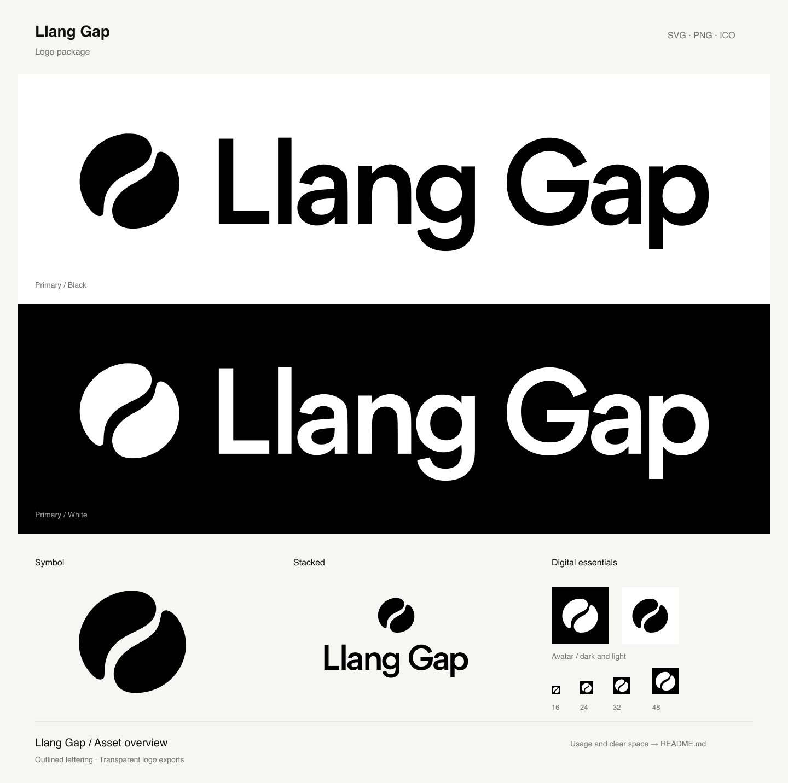

# Llang Gap logo package

The supplied black/white references, reconstructed as smooth vector outlines.
The flowing gap and lettering are retained; stems, baselines and
the repeated **a** are cleaned up. The lettering is outlined artwork, not a font
you need to install. The website's interface font remains a separate choice.



## Pick a file

For the Fable 5.1 + GPT-6 Astra announcement, see the
[five release post options](release-posts/fable-5.1-gpt-6-astra/README.md), with
ready-to-post PNGs and outlined SVG masters covering the six announcement languages.

Use **SVG** for websites, Figma, slide editors and any size of artwork. Use
**PNG** when the destination cannot import SVG. Use the icon files for browser
tabs and home screens. Black and white logo exports have transparent backgrounds;
avatars and icons have deliberately opaque backgrounds.

| Composition             | Black SVG                                          | White SVG                                        | PNG size    |
| ----------------------- | -------------------------------------------------- | ------------------------------------------------ | ----------- |
| Primary horizontal logo | [Black](svg/llang-gap-logo-black.svg)              | [White](svg/llang-gap-logo-white.svg)            | 2048 × 491  |
| Standalone symbol       | [Black](svg/llang-gap-mark-black.svg)              | [White](svg/llang-gap-mark-white.svg)            | 1024 × 1024 |
| Wordmark                | [Black](svg/llang-gap-wordmark-black.svg)          | [White](svg/llang-gap-wordmark-white.svg)        | 2048 × 576  |
| Stacked logo            | [Black](svg/llang-gap-stacked-black.svg)           | [White](svg/llang-gap-stacked-white.svg)         | 1024 × 576  |
| Square avatar           | [Light background](svg/llang-gap-avatar-light.svg) | [Dark background](svg/llang-gap-avatar-dark.svg) | 1024 × 1024 |

Matching raster files are in [png/](png/). White artwork can look blank in an
editor with a white canvas; place it over a dark background. The
[overview SVG](preview.svg) and [overview PNG](preview.png) show both treatments.

The [icons/](icons/) directory contains:

- [favicon.svg](icons/favicon.svg): white symbol on black, with a larger symbol
  than the avatar for small browser tabs.
- [favicon.ico](icons/favicon.ico): 16, 24, 32, 48, 64, 128 and 256 px frames.
- [apple-touch-icon.png](icons/apple-touch-icon.png): 180 × 180 px.
- [icon-192.png](icons/icon-192.png) and [icon-512.png](icons/icon-512.png): square
  home-screen assets. These are ordinary icons, not declared maskable assets.

## Placement

Prefer the horizontal logo where the name needs to be read. Use the symbol for
compact, already identified contexts, and the stacked composition in taller spaces.

The horizontal symbol is about 1.1 times the capital-letter height. Its center
sits slightly below the capital midline to balance the lowercase letters and
descenders; the gap to the name is about one fifth of the symbol’s width. In the
stacked composition the symbol is about the height of the complete wordmark,
with a vertical gap of about one quarter of its height. Use the supplied
compositions to retain this balance rather than repositioning their parts.

- Keep the original aspect ratio, letter spacing and gap between symbol and name.
- Use solid **#000000** on light backgrounds or **#FFFFFF** on dark backgrounds.
  Keep the gap transparent; it is part of the silhouette.
- Leave clear space of at least **one quarter of the visible symbol's width**
  around a complete logo. For a wordmark alone, use half the capital **L** height.
  The SVG canvas has a small convenience margin; add the remaining clear space in
  the destination layout. Dedicated avatars and favicons are compact exceptions.
- Minimum displayed canvas widths: horizontal **128 px** in compact navigation
  (**160 px** elsewhere), wordmark **120 px**,
  stacked **120 px**, standalone symbol **24 px**. Use the dedicated favicon for
  16 px. Below these sizes, use a larger mark or allow more room.
- Keep avatars square and let the destination apply its circular or rounded mask.
  Do not bake rounded corners into home-screen icons.
- Avoid stretching, rotation, outlines, shadows, gradients or putting the logo
  over visually busy imagery.

## Web handoff

Assets in this directory are the design masters. The website serves copies of the
black horizontal logo and symbol from `apps/web/public/brand/`, shared by the header
and footer. At 480 px and below, the header uses the symbol; the footer keeps the full logo.
The header logo is 128 px wide with a 2 px downward optical offset to balance the
letter bodies against the descenders. Its compact symbol has no offset. The footer
keeps the 160 px logo.
CSS inverts the black artwork to white using the site's `.dark` class, so the logo
follows both system appearance and the saved theme choice without changing the SVG.

The browser favicon in `apps/web/src/app/icon.svg` keeps the geometry of
`icons/favicon.svg` with a transparent background. Its symbol is black by default
and white in the browser's dark color scheme, independently of the site's theme
toggle. `apps/web/src/app/favicon.ico` is the transparent black fallback, exported
from the default SVG treatment at 16, 24, 32, 48, 64, 128 and 256 px.
`apps/web/src/app/apple-icon.png` is a copy of `icons/apple-touch-icon.png` and keeps
its solid background for home screens.

When updating the masters, refresh the application variants in the same change;
preserve the favicon's transparency and color-scheme rule, and re-export its ICO.
Copy only assets that the website uses; no build-time export step is needed. The
root README references the black/white masters directly and uses a `<picture>`
element for GitHub's light/dark appearance.

For an external image, use the fixed black/white files and provide appropriate
alternative text, for example `alt="Llang Gap"`. If visible adjacent text already
names the brand, use `alt=""` to avoid announcing it twice.

The four `*-current.svg` files inherit CSS `color` **when inlined as SVG**:
[horizontal](svg/llang-gap-logo-current.svg),
[symbol](svg/llang-gap-mark-current.svg),
[wordmark](svg/llang-gap-wordmark-current.svg),
[stacked](svg/llang-gap-stacked-current.svg).
An SVG loaded through `` does not inherit the parent page's color. Standalone
current-color files default to black. Every logo SVG has a `viewBox`, a title and
an accessible label; set `aria-hidden="true"` for decorative inline instances.

## Editing and export

The files in [svg/](svg/) are the editable vector masters. Import them into a
vector editor as paths. Keep matching geometry synchronized across the black,
white and current-color versions, and reuse the same wordmark in both layouts.
No logo asset contains live text, raster images, external fonts, scripts, masks
or external resources. Only the overview has ordinary text labels.

After editing, export PNGs at the canvas dimensions in the table above, retaining
alpha for logos and solid backgrounds for avatars/icons. Export icons at their
named sizes; rebuild all ICO frames from the favicon artwork. Inspect the gap and
letter counters at the minimum sizes, check both backgrounds, and refresh the
overview. Keep SVG for scale-independent delivery; the PNG exports use sRGB.

To make a shareable archive from the repository root (without duplicating an
archive in Git):

```sh
zip -r /tmp/llang-gap-logo-package.zip brand LICENSE -x '*/.DS_Store'
```

The reference screenshots are review evidence, not source assets. The package
adds no third-party font files or runtime dependencies. Repository licensing is
described in [LICENSE](../LICENSE).
