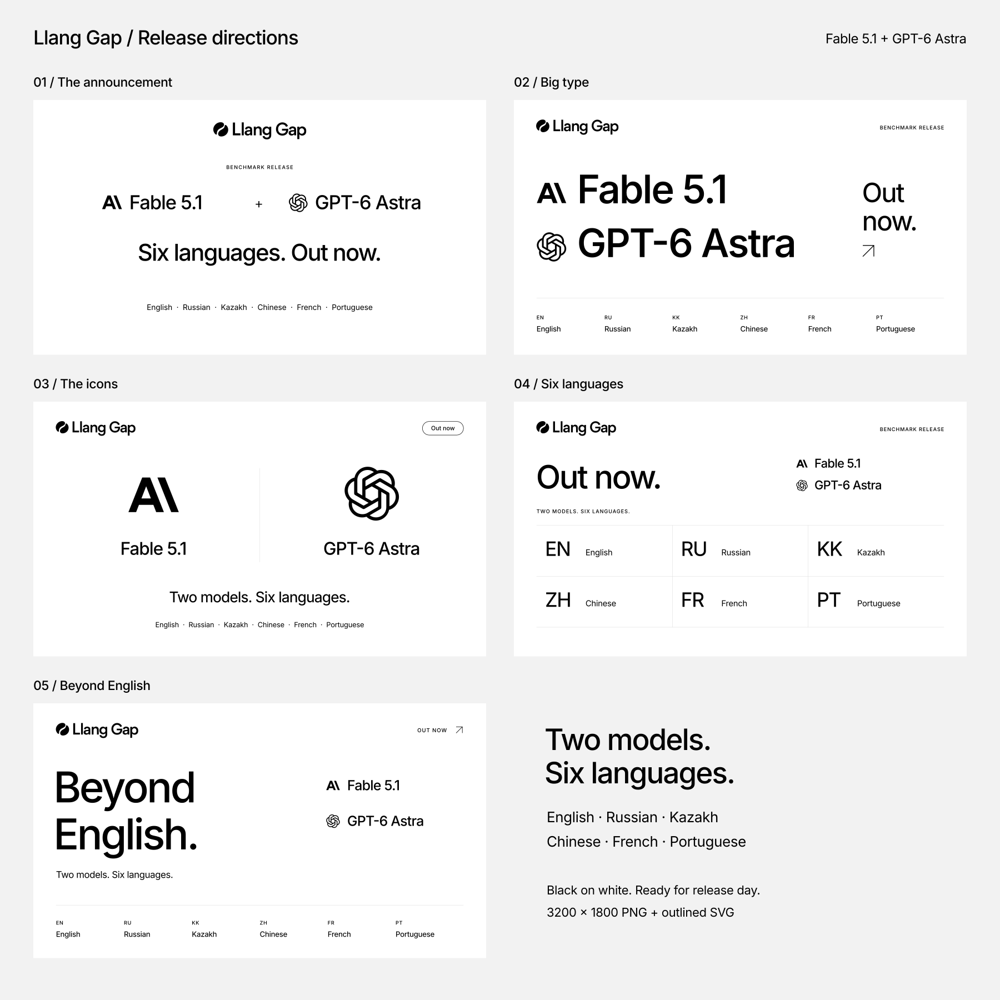

# Fable 5.1 + GPT-6 Astra release graphics

Five release-day directions featuring Fable 5.1 (Anthropic), GPT-6 Astra (OpenAI),
and English, Russian, Kazakh, Chinese, French, and Portuguese.

| Option | Direction                                 | PNG                               | SVG                             |
| ------ | ----------------------------------------- | --------------------------------- | ------------------------------- |
| 01     | The announcement — centered model pairing | [Download](01-announcement.png)   | [Vector](01-announcement.svg)   |
| 02     | Big type — oversized model names          | [Download](02-big-type.png)       | [Vector](02-big-type.svg)       |
| 03     | The icons — prominent provider marks      | [Download](03-icons.png)          | [Vector](03-icons.svg)          |
| 04     | Six languages — equal language grid       | [Download](04-language-grid.png)  | [Vector](04-language-grid.svg)  |
| 05     | Beyond English — editorial headline       | [Download](05-beyond-english.png) | [Vector](05-beyond-english.svg) |

## Use and edit

Post the individual **3200 × 1800 px PNGs**, exported in sRGB with an opaque white
background. All options use the same 16:9 composition. The overview is a selection
board; its option numbers are outside the individual artwork.

The **1600 × 900 SVGs** are the vector masters. Text is outlined Inter, so files
render consistently without installed fonts. Import into a vector editor to
adjust paths or replace the outlined copy with live text. Preserve logo aspect
ratios and the [brand clear space](../../README.md#placement).

These assets are prepared for release day: “Out now” is publication copy, not
evidence that a benchmark release has been published. They contain no scores,
rankings, dataset claims, or release IDs. The named models and six languages
describe this specific announcement, not application defaults or a universal
benchmark scope. Website UI locales remain separate.

Suggested alternative text: “Llang Gap: Fable 5.1 and GPT-6 Astra, out now in
English, Russian, Kazakh, Chinese, French, and Portuguese.”

## Asset sources

The Llang Gap logo uses the existing [black vector master](../../svg/llang-gap-logo-black.svg).
Provider marks retain the geometry of the repository's
[Anthropic](../../../apps/web/public/model-owners/anthropic.svg) and
[OpenAI](../../../apps/web/public/model-owners/openai.svg) assets. They are the real
company marks, not invented model-specific logos. Their Lobe Icons attribution is
documented [here](../../../apps/web/public/model-owners/README.md); the upstream
MIT notice is retained in [LICENSE](LICENSE). Company names and logos remain
trademarks of their respective owners.

Typography uses the existing Inter 5.3.0 package under the SIL Open Font License.
Only outlined artwork is included; no font files or runtime dependencies are added.
