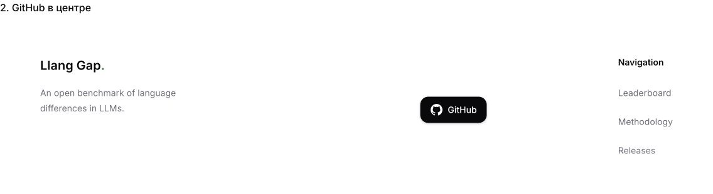
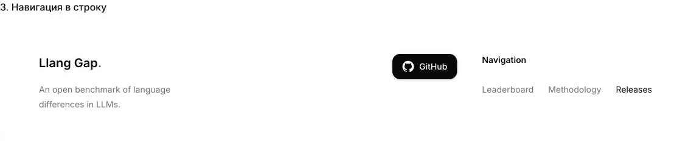

# Footer layout options

The border is removed in all three options. The brand and description remain unchanged, and Navigation is the rightmost group. The default is `paired`.

## Paired

GitHub sits just left of Navigation, leaving open space after the brand.

## Spread

GitHub is centered in the available space between the brand and Navigation.

## Compact

Navigation links run horizontally, with GitHub immediately to their left.

Run `pnpm --filter @llang-gap/web dev` and open `/en/footer-preview/` or `/ru/footer-preview/` to compare the live components. The preview returns not-found in production. Change the `variant` prop on `SiteFooter` to select an alternative.

On mobile, the brand occupies the first row, followed by GitHub on the left and vertical Navigation on the right.
