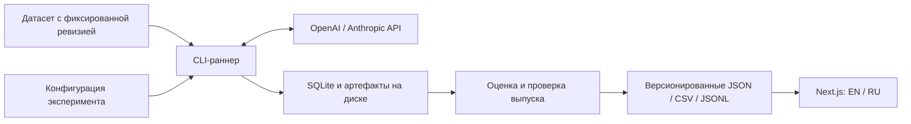

# Llang Gap — проект MVP

Дата: 6 сентября 2026 года. Статус: архитектура согласована; ядро MVP, раннер и проверки реализованы. Сайт дорабатывается отдельно. Платные прогоны ещё не начаты. Практические инструкции: [README](../README.md), [раннер](runner.md), [протокол](protocol.md), [выпуски](releases.md).

## 1. Что уже согласовано

Llang Gap — открытая многоязычная платформа для изучения различий в качестве LLM между языками и способов уменьшить эти различия. Охват будет расширяться, начиная с двух языков первого эксперимента.

Первый выпуск:

- MMLU-ProX Lite, готовые английская и русская версии; меняется язык всего промпта.
- По одной флагманской модели OpenAI и Anthropic, по три уровня effort.
- Одна публичная таблица: модель, effort, EN, RU, разница.
- Интерфейс и методика на английском и русском с первого запуска.
- Открытые код, методика и результаты отдельных заданий.
- Первый протокол — 5-shot CoT на основе протокола авторов.
- Базовая архитектура монорепозитория, границы пакетов и стек из первого предложения согласованы.
- Для lint и форматирования выбраны oxlint и oxfmt.
- i18n должен быть модульным, с максимально строгой проверкой типов; единые вручную поддерживаемые каталоги всех переводов в одном JSON не подходят.
- Для i18n выбран next-intl с TypeScript-словарями по модулям.

Уточнения по хранению датасета, конфигурации и CLI ниже — предложения к согласованной архитектуре. Библиотека i18n согласована. Окончательные параметры платных запусков фиксируются после пилота. Ключевой результат MVP: посетитель видит различия и может проверить происхождение каждой цифры.

## 2. Датасет и протокол

### Данные

У проверенной ревизии `li-lab/MMLU-ProX-Lite` на каждый язык приходится **588 test + 70 validation**. Указанные на сайте проекта 658 — сумма двух частей. Итоговая оценка считается только на test. Ревизия, проверенная при проектировании: `e82aafb9460529687d3c7e51b401d8dd1dd309dd`. [Карточка и метаданные датасета](https://huggingface.co/datasets/li-lab/MMLU-ProX-Lite/blob/e82aafb9460529687d3c7e51b401d8dd1dd309dd/README.md).

На этапе импорта фиксируем исходные Parquet-файлы и SHA-256, преобразуем их в нормализованный JSONL. Проверяем количество строк, уникальность идентификаторов, соответствие EN/RU, категории, варианты и ключи ответов. Ключ пары строим из идентификаторов исходного задания с учётом split; порядок строк не является ключом. Семантическое качество переводов не объявляем проверенным автоматически.

Предлагаемое хранение: в Git находится `datasets/mmlu-prox-lite/manifest.json` с dataset ID, точным upstream commit, путями и SHA-256 файлов, splits и количеством строк. Исходные файлы и нормализованные данные скачиваются в локальный кеш `.llang-gap/datasets/`. Каталог `.llang-gap/` исключается из Git и из lint/format.

`dataset prepare` получает только файлы языков, необходимых эксперименту, включая test и validation. При `run` эта подготовка вызывается автоматически, если кеша ещё нет. Повторные запуски используют проверенный кеш; обновление upstream `main` не меняет наш набор. Загрузка идёт по зафиксированной ревизии во временные файлы; после проверки хешей файлы атомарно перемещаются в кеш. Несовпадение хеша останавливает подготовку до платных вызовов.

Ключ кеша включает dataset ID, upstream revision и версию нормализатора. Для `--offline` все файлы должны уже находиться в кеше; скрытого обращения к сети нет. В воспроизводимый архив выпуска включаем manifest и использованный снимок входных данных с атрибуцией, чтобы пересчёт не зависел от дальнейшей доступности Hugging Face. Обновление датасета — отдельное изменение manifest в Git и новый эксперимент.

```text
datasets/mmlu-prox-lite/manifest.json       # отслеживается Git
.llang-gap/datasets/<dataset>/<revision>/  # локальный кеш
.llang-gap/runs/<run-id>/state.sqlite      # журнал одного запуска
.llang-gap/runs/<run-id>/resolved.json     # фактическая конфигурация
```

Карточка датасета содержит указание MIT License. В производных данных сохраняем атрибуцию и условия исходных материалов; лицензия нашего кода оформляется отдельно. [Указание лицензии](https://huggingface.co/datasets/li-lab/MMLU-ProX-Lite/blob/e82aafb9460529687d3c7e51b401d8dd1dd309dd/README.md#license).

### Протокол: согласован 5-shot CoT

Для первого публичного выпуска выбран **5-shot CoT**, основанный на протоколе авторов: пять примеров с решениями из validation соответствующей категории, затем тестовое задание. Шаблоны и примеры берём из существующей реализации и фиксируем её commit. EN и RU используют соответствующие языковые версии одних и тех же примеров, порядок вариантов сохраняется. [Описание результатов авторов](https://mmluprox.github.io/), [реализация в lm-evaluation-harness](https://github.com/EleutherAI/lm-evaluation-harness/tree/main/lm_eval/tasks/mmlu_prox).

Основной протокол — `mmluprox-lite-5shot-author-api-v3`: точные авторские промпты, первые пять validation-примеров своего предмета в исходном порядке, первый match авторского regex и стоп-строки. Лимит API — 2048 токена, включая скрытое reasoning. Greedy decoding с `temperature: 0` выбранные API не поддерживают; формат сообщений и нативный effort остаются явными адаптациями. [Полная сверка и ограничения](protocol.md), [текущий план сравнения](first-comparison.md).

Экспериментальный v2 из PR #16 не входит в основной план; предложение PR #12 заменено авторским baseline. V1/v2 и старые результаты сохраняются на своих ревизиях без пересчёта. Датасет, переводы, варианты, ключи и все 588 заданий неизменны; замечания к данным документируются как ограничения, а не исправляются или исключаются ради сравнения.

Zero-shot — возможный следующий эксперимент: задание без демонстрационных примеров, с нативным reasoning модели. Это отдельный протокол; результаты разных протоколов не объединяются в одну сопоставимую таблицу. 5-shot описывает содержание промпта, а effort — нативную настройку модели; их можно исследовать независимо.

Общие условия:

- Отдельный независимый запрос на каждое задание; без истории предыдущих вопросов, поиска и инструментов.
- Язык инструкции, примеров, задания и вариантов соответствует условию EN или RU. Служебные метки сохраняются согласно выбранному шаблону.
- Эталон и `cot_content` тестового задания доступны оценщику, но не генератору промпта. Для разрешённых few-shot примеров ответы и решения включаются явно.
- Модель возвращает финальный ответ; правильность определяется сравнением извлечённой буквы с эталоном. LLM-судья не нужен.
- Парсер детерминирован, версионирован, проверяется на EN/RU и неоднозначных ответах. Поведение относительно референсного парсера документируется.
- API-параметры задаются явно там, где поддерживаются. Несовместимые настройки вызывают ошибку до запуска; значения не подменяются молча.
- Авторский лимит вывода 2048 зафиксирован; больший лимит требует отдельного протокола. Для пары EN/RU одной конфигурации лимит одинаковый; языки могут фактически расходовать разное число токенов.
- Модели и языки запускаются в перемешанном, сбалансированном порядке в близком временном окне; seed расписания записывается. Это не seed генерации модели.

### Модели и effort

Кандидаты по официальной документации на дату проектирования:

| Провайдер | Модель             | Предлагаемые уровни     |
| --------- | ------------------ | ----------------------- |
| OpenAI    | `gpt-6-astra`      | `low`, `medium`, `high` |
| Anthropic | `claude-fable-5-1` | `low`, `medium`, `high` |

Основание: [GPT-6 Astra](https://developers.openai.com/api/docs/models/gpt-6-astra), [Claude Fable 5.1](https://platform.claude.com/docs/en/models/fable-5-1/overview), [Anthropic effort](https://platform.claude.com/docs/en/build-with-claude/effort). Доступность для наших API-аккаунтов ещё не проверена. Перед первым запуском проверяем модель и все три конфигурации через API; замена модели требует новой конфигурации эксперимента.

Effort — нативная настройка провайдера. Совпадение названий не означает одинаковый вычислительный бюджет. Сравнение языков проводится внутри одной конфигурации модели; стоимость и usage публикуются как дополнительный контекст. `high` не обозначает максимальную доступную способность: у этих моделей есть уровни выше.

Сохраняем запрошенный и возвращённый model ID, доступный snapshot/version, endpoint, параметры, SDK version, время и request ID. Если провайдер не предоставляет неизменяемую версию, явно указываем это ограничение воспроизводимости.

## 3. Метрики и повторы

Основная метрика — доля правильных ответов по всем тестовым заданиям. Для каждого задания вес одинаковый; разрезы по категориям вторичны.

`gap_pp = 100 × (accuracy_en − accuracy_ru)`

Положительная разница означает более низкий результат RU. Единица — процентные пункты. Малый gap сам по себе не означает хорошую модель, поэтому обе абсолютные оценки всегда стоят рядом.

Рекомендация: три заранее запланированных независимых повтора всей матрицы. Показываем среднюю accuracy, число уникальных заданий `N = 588`, число повторов и разброс результатов между повторами. Итоговый балл не использует выбор лучшего повтора, majority vote или повторную попытку исправить неправильный ответ.

- Один проход: `588 × 2 языка × 2 модели × 3 effort = 7 056` запросов.
- Три прохода: `21 168` запросов без технических retries и пилота.
- Для сравнения языков рассчитываем парный 95% bootstrap-интервал: пересэмплируем идентификаторы заданий, сохраняя обе языковые версии и все повторы каждого задания вместе. Например, 10 000 выборок с зафиксированным seed.
- Такой интервал характеризует вариативность по заданиям принятого бенчмарка. Разброс повторов показываем отдельно; 1 764 ответа на язык не объявляем 1 764 независимыми заданиями.
- Если интервал gap включает ноль, интерфейс сообщает, что измерение не позволяет уверенно определить направление различия. При добавлении множественных сравнений потребуется отдельная статистическая политика.

Ошибки обработки:

| Событие                                          | Поведение                                                           |
| ------------------------------------------------ | ------------------------------------------------------------------- |
| Правильный / неправильный валидный ответ         | 1 / 0 баллов                                                        |
| Отказ модели или неразбираемый завершённый ответ | 0 баллов; отдельный счётчик; без попыток улучшить ответ             |
| 429, временный 5xx, транспортная ошибка          | Ограниченный retry того же запроса; все попытки остаются в журнале  |
| Исчерпан лимит retries                           | Конфигурация неполная, не публикуется как завершённая               |
| Ответ обрезан лимитом                            | Считаем по авторскому regex, сохраняем truncation; блокируем выпуск |

При truncation сохраняем ответ и его оценку без выборочных повторов. Основной лимит не меняется автоматически; больший лимит означает отдельный протокол и новый полный запуск. Выборочно улучшать только неудачные ответы нельзя. Парный gap публикуется при одинаковом полном наборе заданий и повторов на обоих языках.

## 4. Архитектура



Сайт читает завершённые выпуски. Прогон выполняется отдельным процессом вне веб-запросов. Публикация — явный этап после проверки данных; повторная сборка сайта не запускает модели.

### Монорепозиторий

```text
apps/
  web/                    Next.js, страницы, компоненты, локализация
  runner/                 CLI, очередь, retries, SQLite, экспорт
packages/
  contracts/              схемы данных и публичные контракты
  datasets/               импорт, нормализация и проверки MMLU-ProX Lite
  providers/              адаптеры OpenAI и Anthropic
  evaluation/             промпты, парсеры, scoring, статистика
experiments/              версионированные определения экспериментов
datasets/                 manifests источников и контрольные суммы
results/                  небольшие manifests и агрегаты выпусков
config/                   общие настройки TypeScript и инструментов
docs/                     методика, архитектура, решения
```

Границы:

- `contracts` задаёт Zod-схемы; типы выводятся из них. В нём нет React, сетевых вызовов и хранения.
- `datasets`, `providers`, `evaluation` зависят от `contracts`, но не от приложений и не друг от друга.
- `runner` связывает пакеты, владеет состоянием выполнения и внешними эффектами.
- `web` импортирует `contracts` и опубликованные данные. Он не зависит от SDK провайдеров и не пересчитывает научные метрики в браузере.
- В `evaluation` чистые функции; время, случайность bootstrap и зависимости передаются явно.
- Пакеты имеют короткий публичный API через `exports`; циклические зависимости и импорты внутренностей других пакетов запрещены.
- Компоненты единственного сайта остаются в `apps/web`. Общий UI-пакет выделяется при появлении второго потребителя.

### Технологии

Предлагается единый TypeScript-стек. Текущий объём — API-вызовы, выбор ответа и небольшая статистика; отдельный Python-runtime пока не даёт достаточной пользы. Референсный lm-evaluation-harness используем для сверки шаблонов и оценки на сохранённых примерах. Если появятся локальные модели и исследовательские процедуры на Python, они смогут отдавать тот же формат артефактов.

| Слой            | Выбор                                      | Назначение                                                                   |
| --------------- | ------------------------------------------ | ---------------------------------------------------------------------------- |
| Runtime         | Node.js 24 LTS                             | Стабильный серверный runtime                                                 |
| Язык            | TypeScript, strict                         | Явные контракты и проверка границ                                            |
| Монорепозиторий | pnpm workspaces + Turborepo                | Общие зависимости, граф build/test/typecheck                                 |
| Сайт            | Next.js App Router + React                 | Серверная генерация HTML, маршруты и SEO                                     |
| i18n            | next-intl                                  | TypeScript-словари по модулям, строгие ключи и ICU-аргументы, EN/RU маршруты |
| Стили           | Tailwind CSS                               | Небольшая собственная система компонентов                                    |
| Схемы           | Zod                                        | Валидация dataset, конфигураций и выпусков                                   |
| Конфигурация    | YAML + `yaml` + Zod                        | Читаемые определения экспериментов с проверкой схемы                         |
| CLI             | Commander.js                               | Подкоманды, аргументы, help, асинхронные обработчики                         |
| Провайдеры      | Официальные `openai` и `@anthropic-ai/sdk` | Доступ к нативным параметрам и usage                                         |
| Выполнение      | SQLite + файловые артефакты                | Durable checkpoint и resume одного раннера                                   |
| Проверки        | Vitest, Playwright, oxlint, oxfmt          | Методика/раннер, браузерные сценарии, lint и формат                          |
| CI              | GitHub Actions                             | Воспроизводимая сборка, проверки, сборка выпуска                             |

Node.js 24 выбран как актуальная LTS-линия. [Release schedule](https://nodejs.org/en/about/previous-releases). pnpm предоставляет workspaces и локальные зависимости `workspace:`. [Документация](https://pnpm.io/workspaces). Next.js предоставляет metadata, sitemap и OG-механизмы. [Документация](https://nextjs.org/docs/app/getting-started/metadata-and-og-images).

Проверенные npm `latest` на дату проектирования: [Next 16.3.4](https://registry.npmjs.org/next/latest), [React 19.2.8](https://registry.npmjs.org/react/latest), [TypeScript 7.0.2](https://registry.npmjs.org/typescript/latest), [pnpm 12.3.4](https://registry.npmjs.org/pnpm/latest), [Turbo 2.10.12](https://registry.npmjs.org/turbo/latest), [Tailwind 4.3.3](https://registry.npmjs.org/tailwindcss/latest), [Zod 4.5.4](https://registry.npmjs.org/zod/latest), [Vitest 5.0.0](https://registry.npmjs.org/vitest/latest), [Playwright 1.63.0](https://registry.npmjs.org/@playwright/test/latest), [oxlint 1.81.0](https://registry.npmjs.org/oxlint/latest), [oxfmt 0.66.0](https://registry.npmjs.org/oxfmt/latest), [oxlint-tsgolint 7.0.2001](https://registry.npmjs.org/oxlint-tsgolint/latest), [Commander 15.0.0](https://registry.npmjs.org/commander/latest), [next-intl 4.14.2](https://registry.npmjs.org/next-intl/latest), [yaml 2.9.0](https://registry.npmjs.org/yaml/latest). Это кандидаты для первого lockfile, совместимость всего стека ещё не проверена. На старте реализации устанавливаем совместимые стабильные версии и фиксируем их; обновления выполняем отдельными изменениями.

Oxlint отвечает за lint; для правил, использующих типы, подключаем совместимый `oxlint-tsgolint`. Oxfmt форматирует код, JSON, YAML и Markdown; CI проверяет формат без записи. Typecheck остаётся отдельной задачей TypeScript, чтобы lint и проверка компилятора имели ясные обязанности. [Type-aware linting](https://oxc.rs/docs/guide/usage/linter/type-aware), [Oxfmt](https://oxc.rs/docs/guide/usage/formatter).

Turborepo кеширует детерминированные build/test-задачи. У платных прогонов и публикации кеш выключен; механизм resume принадлежит раннеру. [Правило для задач с внешними эффектами](https://github.com/vercel/turborepo/blob/main/apps/docs/content/docs/crafting-your-repository/configuring-tasks.mdx).

## 5. Раннер и данные эксперимента

Минимальные сущности:

| Сущность          | Что фиксирует                                                                   |
| ----------------- | ------------------------------------------------------------------------------- |
| `DatasetRevision` | Источник, commit, хеши файлов, split, язык, список заданий                      |
| `Protocol`        | Шаблоны, few-shot-примеры, формат ответа, parser/scorer version                 |
| `ModelConfig`     | Провайдер, model ID, нативный effort, thinking, token limits, параметры API     |
| `ExperimentSpec`  | Dataset + protocol + матрица + повторы + правила выполнения                     |
| `Run`             | Конкретное выполнение spec, run ID, commit кода, окружение, начало/конец        |
| `Attempt`         | Попытка запроса, question/language/repeat, запрос, ответ, статус, usage, timing |
| `Result`          | Выбранная завершённая попытка, извлечённый ответ и оценка                       |
| `Release`         | Неизменяемый manifest, включённые runs, метрики, проверки, хеши файлов          |

Язык хранится как значение, без отдельных полей `enScore`/`ruScore` в исходных результатах. Конфигурация effort учитывает провайдера и модель; поддерживаемые значения задаются capabilities модели. Для будущих оптимизаций протокол имеет `strategyId`; на старте реализована одна стратегия.

### Конфигурация эксперимента

Предлагаемый формат — декларативный YAML в `experiments/`. Читаем библиотекой `yaml`, затем проверяем строгой схемой Zod из `contracts`. Неизвестные поля, повторяющиеся YAML-ключи и несовместимые параметры вызывают понятную ошибку до выполнения. JSON Schema генерируется из схемы для автодополнения в редакторе. Исследовательские настройки задаются в файле; CLI управляет запуском и его эксплуатационными параметрами. [Библиотека yaml](https://eemeli.org/yaml/).

Сокращённый пример `experiments/mvp.yaml` — схема интерфейса, не готовый к запуску эксперимент:

```yaml
schemaVersion: 1
id: mvp-en-ru-author-v3
dataset: mmlu-prox-lite
protocol: mmluprox-lite-5shot-author-api-v3
languages: [en, ru]
repeats: 3

models:
  - provider: openai
    model: gpt-6-astra
    efforts: [low, medium, high]
  - provider: anthropic
    model: claude-fable-5-1
    efforts: [low, medium, high]
```

`dataset` разрешается в конкретный manifest с commit и хешами, `protocol` — в версионированное определение шаблонов и правил. Полный файл дополнительно фиксирует token limits для моделей и политику исполнения. До платного `run` требуется лимит расходов; его можно задать в блоке `execution` или через `--budget-usd`. CLI может переопределять только заранее перечисленные эксплуатационные параметры, например concurrency и бюджет. API-ключи поступают из окружения и не включаются в конфигурацию выпуска.

Перед запуском разворачиваем матрицу и записываем канонический `resolved.json`: исходные определения, применённые defaults и CLI overrides, хеши датасета/протокола, все конкретные model/effort/language/repeat условия. Его хеш входит в manifest запуска. `resume` читает зафиксированную конфигурацию запуска; изменения исходного YAML применяются к новому `run`. При resume можно увеличить бюджет или изменить concurrency с записью изменения в журнал; научные параметры остаются фиксированными.

### CLI

Предлагается **Commander.js**. Он предоставляет вложенные команды, проверку аргументов и options, автоматическую справку и асинхронные action handlers. При необходимости используем `@commander-js/extra-typings` для вывода типов аргументов. CLI — тонкий слой: обработчики вызывают обычные функции приложения, а не содержат алгоритмы эксперимента. [Документация Commander.js](https://github.com/tj/commander.js).

CLI предусматривает операции `dataset prepare/validate`, `plan`, `run`, `status`, `resume`, `score`, `release build/verify`. Это проект команд, пока они не реализованы:

```bash
pnpm bench dataset prepare experiments/mvp.yaml
pnpm bench plan experiments/mvp.yaml
pnpm bench run experiments/mvp.yaml
pnpm bench status <run-id>
pnpm bench resume <run-id>
pnpm bench score <run-id>
pnpm bench release build <run-id>
```

Корневой script `bench` делегирует вызов `apps/runner`. `--help` документирует каждую команду. Прогресс идёт в stderr, `--json` даёт машинный результат в stdout. Ctrl+C останавливает отправку новых запросов и корректно закрывает журнал; после аварийного завершения незавершённые попытки восстанавливаются по правилам раннера.

`plan` раскрывает матрицу, проверяет совместимость, показывает число вызовов, оценку бюджета и отсутствующие данные без обращения к генерации. `run` ведёт прогресс по заданиям и расходам. Повторный `resume` сохраняет уже завершённые ответы; новый независимый прогон получает новый run ID.

### Зачем SQLite

SQLite — локальный транзакционный журнал одного запуска: `.llang-gap/runs/<run-id>/state.sqlite`. В нём находятся задания и попытки, запросы и сохранённые ответы, usage, статусы и ссылки на результаты оценки. Отдельный сервер БД не требуется. Использование SQLite как внутреннего файла приложения соответствует его предназначению. [Подходящие применения SQLite](https://www.sqlite.org/whentouse.html).

Для MVP используется один процесс раннера с ограниченным числом параллельных запросов и отдельными лимитами по провайдерам. SQLite работает на устойчивом диске; один процесс владеет записью. Короткая транзакция атомарно сохраняет ответ и статус завершения; сеть выполняется вне транзакции. Unique constraints защищают от двойного назначения завершённого результата. После остановки раннер получает оставшиеся задания из журнала и не повторяет вызовы, ответы которых уже надёжно сохранены. Экспортные файлы строятся из этого журнала; рабочий каталог резервируется, сайт к SQLite не подключается.

JSONL тоже позволил бы реализовать журнал, но потребовал бы отдельной логики восстановления незавершённой записи, индексации статусов и согласованности нескольких событий. Для платных длительных прогонов предлагается сохранить SQLite: одна небольшая встроенная БД упрощает эти гарантии. Публичный формат результатов при этом остаётся JSON/CSV/JSONL. ORM и отдельный пакет хранения для MVP не требуются; SQL и миграции находятся в `apps/runner`.

Ключ задания включает run ID, хеш конфигурации, идентификатор вопроса, язык и номер повтора. Retry технической ошибки — новая попытка этого задания. Автоматические retries SDK отключаются или учитываются единым механизмом раннера.

Exactly-once внешний API не обещаем: при сбое после отправки сервер мог выполнить и оплатить запрос. Такие попытки отмечаются отдельно, request ID используется для восстановления, где это поддерживается. В оценку попадает одна попытка по заранее установленному правилу; все известные расходы и неопределённые списания сохраняются.

Пилот нужен для проверки API, парсера, лимитов и оценки расхода. При 5-shot пилотные задания не могут одновременно быть демонстрационными примерами. Для проверки формата используем отдельные технические fixtures; для оценки реальной длины — заранее выбранную небольшую часть test без настройки методики по её правильным ответам. Если настройки не изменились, эти результаты входят в основной проход; при изменении конфигурации пилот не подмешивается к новому запуску. При zero-shot validation можно использовать непосредственно.

Бюджет оцениваем по реальному usage пилота с учётом reasoning, input/output, cache и всех попыток. Ценовой справочник версионируется по дате и режиму API. Перед отправкой резервируем верхнюю оценку стоимости активных запросов, чтобы лимит не учитывал только уже завершившиеся. Сумма в долларах и окончательное число повторов фиксируются после пилота. Batch API — следующий шаг после рабочего обычного режима; его очередь не выдаётся за пользовательскую latency.

## 6. Публикация и сайт

Публикуемый выпуск содержит manifest, агрегаты JSON/CSV, результаты отдельных заданий JSONL и воспроизводимую конфигурацию. Полные ответы API хранятся для аудита в рабочем архиве; публичный экспорт формируется по явной схеме: промпт, доступный финальный ответ, оценка, usage, статусы и параметры. Секреты и транспортные заголовки в экспорт не входят. Недоступные скрытые рассуждения модельного API не требуются для пересчёта метрик.

Небольшие manifests и агрегаты можно хранить в Git. Объёмные архивы — в assets GitHub Releases; формат содержит адреса и SHA-256, поэтому при росте их можно перенести в объектное хранилище без изменения метрик.

Перед публикацией проверяем: полную матрицу, одинаковые наборы вопросов, все повторы, отсутствие незавершённых запросов и truncation, единый протокол внутри сравнения, воспроизводимость агрегатов из сохранённых ответов и контрольные суммы. Публикация выпуска и обновление сайта выполняются отдельным шагом. Ошибка приводит к новому выпуску с описанием исправления; исторические данные не перезаписываются.

Главная таблица содержит шесть строк: по три effort у двух моделей. Столбцы: модель, effort, accuracy EN, accuracy RU, gap EN−RU в п.п. Рядом доступны интервал, N, число повторов, дата и версия протокола. Цвет сопровождается знаком и текстом. Подробности показывают затраты, ошибки и ссылки на данные. Изначальный порядок нейтрален; сортировка доступна по обеим accuracy и gap.

Маршруты:

- `/en` и `/ru` — таблица актуального опубликованного выпуска.
- `/{locale}/methodology` — методика, ограничения и описание датасета.
- `/{locale}/releases` — история выпусков.
- `/{locale}/releases/{id}` — постоянная страница конкретного выпуска и загрузки.

HTML с результатами генерируется на сервере при сборке. Сайт получает фиксированный release ID, а не изменяющийся remote `latest` во время чтения каждой страницы. Новый выпуск запускает новую сборку; незавершённый прогон на сайт не попадает.

SEO: отдельные EN/RU URL, корректные `lang`, self-canonical, `hreflang`, sitemap, metadata, OG-карточки и индексируемая HTML-таблица. Переключатель языка сохраняет текущую страницу. Числа и даты форматируются локально; числовой результат одинаков в обеих версиях. Структурированные данные Dataset описывают опубликованные данные Llang Gap с указанием исходного датасета.

### i18n: согласован next-intl

Переводы принадлежат своему модулю и хранятся в TypeScript-файлах. Каждый модуль экспортирует словари EN/RU и занимает собственный namespace. Общий слой i18n содержит список локалей, загрузчики, навигацию и объявления типов. [Типизация next-intl](https://next-intl.dev/docs/workflows/typescript), [загрузка отдельных словарей](https://next-intl.dev/docs/usage/configuration#messages).

```text
apps/web/src/
  features/
    leaderboard/
      messages/en.ts
      messages/ru.ts
      leaderboard-table.tsx
    methodology/
      messages/en.ts
      messages/ru.ts
      methodology-page.tsx
    releases/
      messages/en.ts
      messages/ru.ts
      release-details.tsx
  shared/
    navigation/
      messages/en.ts
      messages/ru.ts
      language-switcher.tsx
  i18n/
    routing.ts
    request.ts
    navigation.ts
    messages.ts
    types.d.ts
  app/[locale]/...
```

Английские сообщения объявляются через `as const`, чтобы сохранить литеральные типы ICU-строк. Для остальных локалей используем `satisfies` с типом формы словаря: ключи совпадают, переведённые значения остаются строками. `satisfies typeof en` не подходит, поскольку потребовал бы одинаковый текст переводов.

`AppConfig` next-intl объединяет типы namespaces и задаёт `Locale` как `'en' | 'ru'`. В компонентах используем `useTranslations('Leaderboard')`, в асинхронных Server Components — `getTranslations('Leaderboard')`. Типы проверяют namespace, ключи и обязательные ICU-аргументы. [Server Components](https://next-intl.dev/docs/getting-started/app-router).

CI проверяет полноту EN/RU, синтаксис ICU и соответствие параметров языковых версий. Контрольные примеры проверяют ошибки типов для неизвестного ключа, недопустимой локали и пропущенного аргумента. Отдельно проверяются русские формы множественного числа. Экспериментальный `useExtracted` и генерация деклараций из JSON для выбранного формата словарей не требуются.

Локаль берётся из URL; обе версии страниц генерируются при сборке. На сервере разрешается нужный словарь, клиент получает только необходимый контент. Переводы интерфейса находятся в `apps/web`; benchmark-промпты и языковые варианты заданий относятся к отдельному протоколу. Изменение перевода кнопки или переключение `/en` на `/ru` не меняет научные данные. Canonical, hreflang и sitemap формирует приложение на основе общего списка локалей и маршрутов.

На сайте явно указывается область применимости: это результаты академических заданий MMLU-ProX Lite с конкретным протоколом. Они не измеряют всё качество языка, перевода, диалога и профессиональной работы. Возможные ошибки перевода и попадание публичных заданий в обучение — ограничения датасета.

Размещение сайта выбираем при настройке деплоя среди хостингов с поддержкой выбранного режима Next.js. Раннер первоначально запускается локально на устойчивом диске; для расписания переносится на отдельный хост. Онлайн-БД, отдельный backend API и распределённая очередь в выбранном потоке данных MVP не нужны.

## 7. Порядок реализации

1. **Основание:** workspace, совместимый lockfile, strict TypeScript, CI; схемы dataset/protocol/result/release. Готово, когда сборка и проверки проходят из чистого checkout.
2. **Датасет и методика:** фиксированный импорт EN/RU, проверки пар, шаблоны и parser/scorer, сверка с референсной реализацией на fixtures. Готово, когда видны итоговые промпты и воспроизводится ручная оценка сохранённых ответов.
3. **Вертикальный срез:** одна конфигурация модели, небольшой набор, запись/остановка/resume, scoring, тестовый release. Готово, когда весь путь работает и не теряет завершённые результаты после перезапуска.
4. **Полная MVP-матрица:** второй провайдер, три effort, лимиты, пилот, зафиксированные параметры и число повторов. Готово, когда доступны отчёт о стоимости и валидные конфигурации всех условий.
5. **Сайт EN/RU:** таблица, методика, история выпусков, выгрузки, SEO. Готово, когда обе локали читают один release, таблица есть в HTML, а её числа совпадают с артефактами.
6. **Первый публичный выпуск:** полный прогон, независимый пересчёт из сохранённых ответов, проверка, публикация и деплой. Готово, когда третье лицо может скачать данные и получить опубликованные метрики без нового вызова модели.

Критические проверки: утечка эталона в test-промпт, соответствие EN/RU, извлечение ответа, paired gap/интервалы на контрольных данных, crash/resume, 429/retries, лимит расходов, недопуск неполного выпуска. Браузерные сценарии: обе локали, переключение, сортировка и открытие выпуска. CI использует fixtures и fake provider; платные вызовы запускаются явно.

## 8. Рост после MVP

Новый язык подключается данными и шаблоном; новая модель существующего провайдера — записью capabilities и конфигурацией; новый провайдер — адаптером. Стратегии уменьшения gap получают отдельные protocol/strategy ID и сравниваются с исходной стратегией на тех же заданиях. Смена датасета создаёт отдельный benchmark; исторические оценки не смешиваются.

Предлагаемый ритм после первого выпуска: новый запуск при выходе выбранной флагманской модели и периодическая проверка актуальности, например раз в месяц. Расписание, расходы и правила публикации фиксируются после пилота; автоматизация сейчас не создаётся.

SQLite заменяется на PostgreSQL при необходимости нескольких одновременно работающих хостов или центрального управления прогонами. Очередь появляется вместе с распределёнными worker-процессами. Публичный API — когда скачиваемых выпусков станет недостаточно. Собственный датасет разрабатывается после обнаружения конкретного ограничения Lite: потолка качества, недостаточной чувствительности или нехватки нужных задач.

До первого платного массового прогона остаётся зафиксировать техническую адаптацию выбранного 5-shot CoT, окончательные model IDs и доступ к ним, лимиты токенов, число повторов и бюджет. Базовый стек, границы пакетов и next-intl согласованы; уточнения по раннеру — локальный кеш датасета, YAML-конфигурация и Commander.js.
