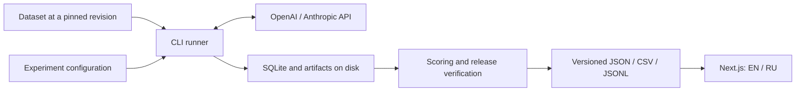

# Llang Gap — MVP plan

Date: September 6, 2026. Status: architecture agreed; the MVP core, runner, and checks are implemented. Website work continues separately. Paid runs have not started yet. Practical guides: [README](../README.md), [runner](runner.md), [protocol](protocol.md), [releases](releases.md).

## 1. Agreed scope

Llang Gap is an open multilingual platform for studying differences in LLM quality across languages and ways to reduce them. Coverage will expand, starting with the two languages in the first experiment.

First release:

- MMLU-ProX Lite, using its existing English and Russian versions; the language of the entire prompt changes.
- One flagship model each from OpenAI and Anthropic, with three effort levels each.
- One public table: model, effort, EN, RU, gap.
- Interface and methodology pages in English and Russian from launch.
- Open code, methodology, and results for individual questions.
- The first protocol is 5-shot CoT based on the authors' protocol.
- The baseline monorepo architecture, package boundaries, and stack from the initial proposal are agreed.
- Oxlint and oxfmt are selected for linting and formatting.
- i18n must be modular, with the strictest practical type checking; a single manually maintained JSON catalog containing all translations is unsuitable.
- next-intl is selected for i18n, with TypeScript dictionaries organized by module.

The dataset storage, configuration, and CLI details below are proposals that extend the agreed architecture. The i18n library is agreed. Final parameters for paid runs are fixed after the pilot. The key MVP outcome: visitors can see the differences and trace every number to its source.

## 2. Dataset and protocol

### Data

The verified revision of `li-lab/MMLU-ProX-Lite` contains **588 test + 70 validation** questions per language. The 658 listed on the project website is the sum of both splits. The final score uses only the test split. Revision checked during planning: `e82aafb9460529687d3c7e51b401d8dd1dd309dd`. [Dataset card and metadata](https://huggingface.co/datasets/li-lab/MMLU-ProX-Lite/blob/e82aafb9460529687d3c7e51b401d8dd1dd309dd/README.md).

During import, pin the source Parquet files and their SHA-256 hashes, then convert them to normalized JSONL. Check row counts, unique identifiers, EN/RU alignment, categories, options, and answer keys. Derive the pair key from the source question identifiers and split; row order is not a key. Automated checks do not establish the semantic quality of translations.

Proposed storage: Git tracks `datasets/mmlu-prox-lite/manifest.json`, containing the dataset ID, exact upstream commit, file paths and SHA-256 hashes, splits, and row counts. Source files and normalized data are downloaded to the local `.llang-gap/datasets/` cache. Exclude `.llang-gap/` from Git and lint/format checks.

`dataset prepare` fetches only the languages required by the experiment, including test and validation files. `run` performs this preparation automatically if the cache does not exist. Subsequent runs use the verified cache; updates to upstream `main` do not change our dataset. Download the pinned revision to temporary files, verify hashes, then move the files into the cache atomically. A hash mismatch stops preparation before paid calls.

The cache key includes the dataset ID, upstream revision, and normalizer version. For `--offline`, all files must already be cached; dataset preparation makes no hidden network requests. Include the manifest and the input snapshot with attribution in the reproducible release archive, so recalculation does not depend on continued Hugging Face availability. A dataset update requires a separate manifest change in Git and a new experiment.

```text
datasets/mmlu-prox-lite/manifest.json       # tracked in Git
.llang-gap/datasets/<dataset>/<revision>/  # local cache
.llang-gap/runs/<run-id>/state.sqlite      # journal for one run
.llang-gap/runs/<run-id>/resolved.json     # resolved configuration
```

The dataset card specifies the MIT License. Retain attribution and source terms in derived data; license our code separately. [License statement](https://huggingface.co/datasets/li-lab/MMLU-ProX-Lite/blob/e82aafb9460529687d3c7e51b401d8dd1dd309dd/README.md#license).

### Protocol: 5-shot CoT agreed

The first public release uses **5-shot CoT** based on the authors' protocol: five worked validation examples from the matching category, followed by the test question. Take templates and examples from the existing implementation and pin its commit. EN and RU use the corresponding language versions of the same examples, preserving option order. [Authors' results](https://mmluprox.github.io/), [lm-evaluation-harness implementation](https://github.com/EleutherAI/lm-evaluation-harness/tree/main/lm_eval/tasks/mmlu_prox).

The primary protocol is `mmluprox-lite-5shot-author-api-v3`: exact author prompts, the first five validation examples for the subject in source order, the first match of the authors' regex, and stop strings. The API limit is 2048 tokens, including hidden reasoning. The selected APIs do not support greedy decoding with `temperature: 0`; message format and native effort remain explicit adaptations. [Full parity details and limitations](protocol.md), [current comparison plan](first-comparison.md).

Experimental v2 from PR #16 is outside the primary plan; the proposal in PR #12 is superseded by the author baseline. V1/v2 and earlier results remain at their original revisions without rescoring. The dataset, translations, options, keys, and all 588 questions remain unchanged; data concerns are documented as limitations rather than corrected or excluded for the comparison.

Zero-shot is a possible subsequent experiment: a question without demonstration examples, using the model's native reasoning. It is a separate protocol; results from different protocols are not combined into one comparable table. 5-shot describes prompt content, while effort is a native model setting; they can be studied independently.

Common conditions:

- A separate independent request for each question, without previous-question history, search, or tools.
- Instructions, examples, questions, and options use the language of the EN or RU condition. Preserve structural labels according to the selected template.
- The test question's answer key and `cot_content` are available to the scorer, but not the prompt generator. Include answers and solutions explicitly for permitted few-shot examples.
- The model returns a final answer; correctness is determined by comparing the extracted letter with the answer key. No LLM judge is needed.
- The parser is deterministic, versioned, and checked against EN/RU and ambiguous responses. Document its behavior relative to the reference parser.
- Set API parameters explicitly where supported. Incompatible settings fail before execution; values are never silently substituted.
- The authors' output limit of 2048 is fixed; a higher limit requires a separate protocol. Each configuration uses the same limit for its EN/RU pair, although actual token use may differ by language.
- Run models and languages in a shuffled, balanced order within a close time window; record the schedule seed. This is not a model generation seed.

### Models and effort

Candidates based on official documentation at the planning date:

| Provider  | Model              | Proposed levels         |
| --------- | ------------------ | ----------------------- |
| OpenAI    | `gpt-6-astra`      | `low`, `medium`, `high` |
| Anthropic | `claude-fable-5-1` | `low`, `medium`, `high` |

Sources: [GPT-6 Astra](https://developers.openai.com/api/docs/models/gpt-6-astra), [Claude Fable 5.1](https://platform.claude.com/docs/en/models/fable-5-1/overview), [Anthropic effort](https://platform.claude.com/docs/en/build-with-claude/effort). Availability for our API accounts has not yet been verified. Before the first run, verify the model and all three configurations through the API; replacing a model requires a new experiment configuration.

Effort is a native provider setting. Matching names do not imply equal compute budgets. Compare languages within a single model configuration; publish cost and usage as additional context. `high` does not mean the maximum available capability: these models have higher levels.

Record requested and returned model IDs, available snapshot/version, endpoint, parameters, SDK version, time, and request ID. If the provider does not expose an immutable version, state this reproducibility limitation explicitly.

## 3. Metrics and repeats

The primary metric is the proportion of correct answers across all test questions. Every question has equal weight; category breakdowns are secondary.

`gap_pp = 100 × (accuracy_en − accuracy_ru)`

A positive gap means a lower RU score. The unit is percentage points. A small gap alone does not imply a good model, so always show both absolute scores alongside it.

Recommendation: three independent repeats of the full matrix, planned in advance. Show mean accuracy, the number of unique questions `N = 588`, the number of repeats, and variation between repeats. The final score does not select the best repeat, use majority voting, or retry incorrect answers to improve them.

- One pass: `588 × 2 languages × 2 models × 3 effort levels = 7 056` requests.
- Three passes: `21 168` requests, excluding technical retries and the pilot.
- For language comparisons, calculate a paired 95% bootstrap interval by resampling question identifiers, keeping both language versions and all repeats of each question together. For example, use 10 000 samples with a fixed seed.
- This interval describes variation across questions in the selected benchmark. Show variation between repeats separately; do not treat 1 764 responses per language as 1 764 independent questions.
- If the gap interval includes zero, the interface states that the measurement cannot confidently establish the direction of the difference. Adding multiple comparisons will require a separate statistical policy.

Error handling:

| Event                                           | Behavior                                                                    |
| ----------------------------------------------- | --------------------------------------------------------------------------- |
| Correct / incorrect valid response              | Score 1 / 0                                                                 |
| Model refusal or unparseable completed response | Score 0; separate counter; no attempts to improve the answer                |
| 429, temporary 5xx, transport error             | Bounded retry of the same request; retain all attempts in the journal       |
| Retry limit exhausted                           | Configuration is incomplete and cannot be published as complete             |
| Response truncated by the limit                 | Score using the authors' regex, retain truncation status, and block release |

For truncation, retain the response and its score without selective retries. The primary limit does not change automatically; a higher limit means a separate protocol and a new full run. Do not selectively improve failed responses. Publish the paired gap only when both languages have the same complete set of questions and repeats.

## 4. Architecture



The website reads completed releases. Runs execute in a separate process outside web requests. Publication is an explicit step after data verification; rebuilding the website does not invoke models.

### Monorepo

```text
apps/
  web/                    Next.js, pages, components, localization
  runner/                 CLI, queue, retries, SQLite, export
packages/
  contracts/              data schemas and public contracts
  datasets/               MMLU-ProX Lite import, normalization, and checks
  providers/              OpenAI and Anthropic adapters
  evaluation/             prompts, parsers, scoring, statistics
experiments/              versioned experiment definitions
datasets/                 source manifests and checksums
results/                  small release manifests and aggregates
config/                   shared TypeScript and tooling settings
docs/                     methodology, architecture, decisions
```

Boundaries:

- `contracts` defines Zod schemas and derives types from them. It contains no React, network calls, or storage.
- `datasets`, `providers`, and `evaluation` depend on `contracts`, but not on applications or one another.
- `runner` connects the packages and owns execution state and side effects.
- `web` imports `contracts` and published data. It does not depend on provider SDKs or recalculate scientific metrics in the browser.
- `evaluation` contains pure functions; time, bootstrap randomness, and dependencies are passed explicitly.
- Packages expose a small public API through `exports`; circular dependencies and imports of another package's internals are prohibited.
- Components for the single website remain in `apps/web`. Extract a shared UI package when a second consumer appears.

### Technologies

A unified TypeScript stack is proposed. The current workload consists of API calls, answer extraction, and small statistical calculations; a separate Python runtime does not yet offer enough benefit. Use the reference lm-evaluation-harness to cross-check templates and scoring on saved examples. Future local models and Python research procedures can produce the same artifact format.

| Layer         | Choice                                    | Purpose                                                                        |
| ------------- | ----------------------------------------- | ------------------------------------------------------------------------------ |
| Runtime       | Node.js 24 LTS                            | Stable server runtime                                                          |
| Language      | TypeScript, strict                        | Explicit contracts and boundary checks                                         |
| Monorepo      | pnpm workspaces + Turborepo               | Shared dependencies and build/test/typecheck graph                             |
| Website       | Next.js App Router + React                | Server-generated HTML, routes, and SEO                                         |
| i18n          | next-intl                                 | TypeScript dictionaries by module, strict keys and ICU arguments, EN/RU routes |
| Styling       | Tailwind CSS                              | Small custom component system                                                  |
| Schemas       | Zod                                       | Dataset, configuration, and release validation                                 |
| Configuration | YAML + `yaml` + Zod                       | Readable experiment definitions with schema validation                         |
| CLI           | Commander.js                              | Subcommands, arguments, help, and asynchronous handlers                        |
| Providers     | Official `openai` and `@anthropic-ai/sdk` | Access to native parameters and usage                                          |
| Execution     | SQLite + file artifacts                   | Durable checkpoints and resume for one runner                                  |
| Checks        | Vitest, Playwright, oxlint, oxfmt         | Methodology/runner tests, browser scenarios, linting, and formatting           |
| CI            | GitHub Actions                            | Reproducible builds, checks, and release assembly                              |

Node.js 24 was selected as the current LTS line. [Release schedule](https://nodejs.org/en/about/previous-releases). pnpm provides workspaces and local `workspace:` dependencies. [Documentation](https://pnpm.io/workspaces). Next.js provides metadata, sitemap, and OG mechanisms. [Documentation](https://nextjs.org/docs/app/getting-started/metadata-and-og-images).

npm `latest` versions checked at the planning date: [Next 16.3.4](https://registry.npmjs.org/next/latest), [React 19.2.8](https://registry.npmjs.org/react/latest), [TypeScript 7.0.2](https://registry.npmjs.org/typescript/latest), [pnpm 12.3.4](https://registry.npmjs.org/pnpm/latest), [Turbo 2.10.12](https://registry.npmjs.org/turbo/latest), [Tailwind 4.3.3](https://registry.npmjs.org/tailwindcss/latest), [Zod 4.5.4](https://registry.npmjs.org/zod/latest), [Vitest 5.0.0](https://registry.npmjs.org/vitest/latest), [Playwright 1.63.0](https://registry.npmjs.org/@playwright/test/latest), [oxlint 1.81.0](https://registry.npmjs.org/oxlint/latest), [oxfmt 0.66.0](https://registry.npmjs.org/oxfmt/latest), [oxlint-tsgolint 7.0.2001](https://registry.npmjs.org/oxlint-tsgolint/latest), [Commander 15.0.0](https://registry.npmjs.org/commander/latest), [next-intl 4.14.2](https://registry.npmjs.org/next-intl/latest), [yaml 2.9.0](https://registry.npmjs.org/yaml/latest). These are candidates for the first lockfile; compatibility across the stack has not yet been verified. At implementation start, install and pin compatible stable versions; make upgrades as separate changes.

Oxlint handles linting; add a compatible `oxlint-tsgolint` for rules that use types. Oxfmt formats code, JSON, YAML, and Markdown; CI checks formatting without writing files. Type checking remains a separate TypeScript task, keeping lint and compiler responsibilities clear. [Type-aware linting](https://oxc.rs/docs/guide/usage/linter/type-aware), [Oxfmt](https://oxc.rs/docs/guide/usage/formatter).

Turborepo caches deterministic build/test tasks. Disable caching for paid runs and publication; the runner owns resume behavior. [Tasks with side effects](https://github.com/vercel/turborepo/blob/main/apps/docs/content/docs/crafting-your-repository/configuring-tasks.mdx).

## 5. Runner and experiment data

Minimum entities:

| Entity            | Records                                                                             |
| ----------------- | ----------------------------------------------------------------------------------- |
| `DatasetRevision` | Source, commit, file hashes, split, language, question list                         |
| `Protocol`        | Templates, few-shot examples, answer format, parser/scorer version                  |
| `ModelConfig`     | Provider, model ID, native effort, thinking, token limits, API parameters           |
| `ExperimentSpec`  | Dataset + protocol + matrix + repeats + execution rules                             |
| `Run`             | A specific execution of a spec, run ID, code commit, environment, start/end         |
| `Attempt`         | Request attempt, question/language/repeat, request, response, status, usage, timing |
| `Result`          | Selected completed attempt, extracted answer, and score                             |
| `Release`         | Immutable manifest, included runs, metrics, checks, file hashes                     |

Store language as a value, without separate `enScore`/`ruScore` fields in raw results. Effort configuration accounts for provider and model; model capabilities define supported values. The protocol has a `strategyId` for future optimizations; initially, one strategy is implemented.

### Experiment configuration

The proposed format is declarative YAML in `experiments/`. Parse it with the `yaml` library, then validate it with a strict Zod schema from `contracts`. Unknown fields, duplicate YAML keys, and incompatible parameters produce clear errors before execution. Generate JSON Schema from the schema for editor completion. Research settings belong in the file; the CLI controls execution and operational parameters. [yaml library](https://eemeli.org/yaml/).

Abbreviated `experiments/mvp.yaml` example — an interface sketch, not an executable experiment:

```yaml
schemaVersion: 1
id: mvp-en-ru-author-v3
dataset: mmlu-prox-lite
protocol: mmluprox-lite-5shot-author-api-v3
languages: [en, ru]
repeats: 3

models:
  - provider: openai
    model: gpt-6-astra
    efforts: [low, medium, high]
  - provider: anthropic
    model: claude-fable-5-1
    efforts: [low, medium, high]
```

`dataset` resolves to a specific manifest with a commit and hashes; `protocol` resolves to a versioned definition of templates and rules. The full file also fixes model token limits and execution policy. A paid `run` requires a spending limit, set in `execution` or through `--budget-usd`. The CLI may override only explicitly allowed operational parameters, such as concurrency and budget. API keys come from the environment and are excluded from the release configuration.

Before execution, expand the matrix and write canonical `resolved.json`: source definitions, applied defaults and CLI overrides, dataset/protocol hashes, and every concrete model/effort/language/repeat condition. Its hash is included in the run manifest. `resume` reads the frozen run configuration; changes to the source YAML apply to a new `run`. During resume, the budget can be increased or concurrency changed, with the change recorded in the journal; scientific parameters remain fixed.

### CLI

**Commander.js** is proposed. It provides nested commands, argument and option validation, automatic help, and asynchronous action handlers. Use `@commander-js/extra-typings` for argument type inference if needed. The CLI is a thin layer: handlers call ordinary application functions rather than containing experiment algorithms. [Commander.js documentation](https://github.com/tj/commander.js).

The CLI design includes `dataset prepare/validate`, `plan`, `run`, `status`, `resume`, `score`, and `release build/verify`. These commands are a design proposal pending implementation:

```bash
pnpm bench dataset prepare experiments/mvp.yaml
pnpm bench plan experiments/mvp.yaml
pnpm bench run experiments/mvp.yaml
pnpm bench status <run-id>
pnpm bench resume <run-id>
pnpm bench score <run-id>
pnpm bench release build <run-id>
```

The root `bench` script delegates to `apps/runner`. `--help` documents each command. Progress goes to stderr; `--json` writes machine-readable results to stdout. Ctrl+C stops new requests and closes the journal cleanly; after a crash, incomplete attempts are recovered according to runner rules.

`plan` expands the matrix, checks compatibility, and reports call counts, budget estimates, and missing data without requesting generation. `run` tracks question progress and spending. Repeated `resume` calls preserve completed responses; a new independent run receives a new run ID.

### Why SQLite

SQLite is the local transactional journal for one run: `.llang-gap/runs/<run-id>/state.sqlite`. It stores jobs and attempts, requests and saved responses, usage, statuses, and references to scoring results. No separate database server is needed. Using SQLite as an internal application file fits its intended use. [Appropriate uses for SQLite](https://www.sqlite.org/whentouse.html).

The MVP uses one runner process with bounded concurrent requests and separate provider limits. SQLite resides on durable storage, with one process owning writes. A short transaction atomically saves the response and completion status; network operations happen outside the transaction. Unique constraints prevent duplicate assignment of a completed result. After stopping, the runner reads remaining jobs from the journal and does not repeat calls whose responses are durably stored. Export files are built from this journal; back up the working directory, and keep the website disconnected from SQLite.

JSONL could also implement a journal, but would require separate logic for recovering partial writes, indexing statuses, and keeping multiple events consistent. For long paid runs, retain SQLite: one small embedded database simplifies these guarantees. Public results remain JSON/CSV/JSONL. The MVP does not need an ORM or a separate storage package; SQL and migrations live in `apps/runner`.

The job key includes the run ID, configuration hash, question identifier, language, and repeat number. A technical retry creates a new attempt for that job. Disable automatic SDK retries or account for them through the runner's unified mechanism.

Do not promise exactly-once execution of an external API: after a failure following submission, the server may have completed and charged for the request. Mark these attempts separately and use the request ID for recovery where supported. Scoring selects one attempt according to a predefined rule; retain all known costs and uncertain charges.

The pilot checks APIs, the parser, limits, and spending estimates. With 5-shot, pilot questions cannot also serve as demonstration examples. Use separate technical fixtures to check formatting; estimate real response lengths on a small test subset selected in advance, without tuning the methodology to its correct answers. If settings remain unchanged, these results are included in the main pass; if configuration changes, do not mix the pilot into the new run. Zero-shot can use validation directly.

Estimate the budget from actual pilot usage, including reasoning, input/output, cache, and all attempts. Version the pricing catalog by date and API mode. Before submission, reserve an upper cost estimate for active requests so the limit accounts for more than completed calls. Fix the dollar budget and final repeat count after the pilot. Batch API support follows a working regular mode; do not present its queue time as user-facing latency.

## 6. Publication and website

A published release contains a manifest, JSON/CSV aggregates, JSONL results for individual questions, and reproducible configuration. Full API responses remain in the working archive for audit; the public export follows an explicit schema: prompt, available final answer, score, usage, statuses, and parameters. Exclude secrets and transport headers. Unavailable hidden reasoning from the model API is not required to recalculate metrics.

Small manifests and aggregates can live in Git. Large archives belong in GitHub Releases assets; the format includes URLs and SHA-256 hashes, allowing migration to object storage as volume grows without changing metrics.

Before publication, verify the full matrix, matching question sets, all repeats, no incomplete requests or truncation, a single protocol within each comparison, reproducible aggregates from saved responses, and checksums. Release publication and website updates are a separate step. An error requires a new release describing the correction; historical data is not overwritten.

The main table has six rows: three effort levels for each of two models. Columns: model, effort, EN accuracy, RU accuracy, and EN−RU gap in percentage points. Also show the interval, N, repeat count, date, and protocol version. Accompany color with a sign and text. Details show costs, errors, and data links. The initial order is neutral; sorting is available by either accuracy and by gap.

Routes:

- `/en` and `/ru` — table for the current published release.
- `/{locale}/methodology` — methodology, limitations, and dataset description.
- `/{locale}/releases` — release history.
- `/{locale}/releases/{id}` — permanent page and downloads for a specific release.

Generate results HTML on the server at build time. The website receives a fixed release ID rather than reading a changing remote `latest` for each page request. A new release triggers a new build; incomplete runs never reach the website.

SEO: separate EN/RU URLs, correct `lang`, self-canonical URLs, `hreflang`, sitemap, metadata, OG cards, and an indexable HTML table. The language switcher preserves the current page. Format numbers and dates by locale; numerical results are identical in both versions. Dataset structured data describes Llang Gap's published data and attributes the source dataset.

### i18n: next-intl agreed

Translations belong to their module and are stored in TypeScript files. Each module exports EN/RU dictionaries and owns a namespace. The shared i18n layer contains the locale list, loaders, navigation, and type declarations. [next-intl typing](https://next-intl.dev/docs/workflows/typescript), [loading individual dictionaries](https://next-intl.dev/docs/usage/configuration#messages).

```text
apps/web/src/
  features/
    leaderboard/
      messages/en.ts
      messages/ru.ts
      leaderboard-table.tsx
    methodology/
      messages/en.ts
      messages/ru.ts
      methodology-page.tsx
    releases/
      messages/en.ts
      messages/ru.ts
      release-details.tsx
  shared/
    navigation/
      messages/en.ts
      messages/ru.ts
      language-switcher.tsx
  i18n/
    routing.ts
    request.ts
    navigation.ts
    messages.ts
    types.d.ts
  app/[locale]/...
```

Declare English messages with `as const` to retain literal ICU string types. For other locales, use `satisfies` with a dictionary shape type: keys match while translated values remain strings. `satisfies typeof en` is unsuitable because it would require identical translation text.

next-intl's `AppConfig` combines namespace types and defines `Locale` as `'en' | 'ru'`. Use `useTranslations('Leaderboard')` in components and `getTranslations('Leaderboard')` in asynchronous Server Components. Types check namespaces, keys, and required ICU arguments. [Server Components](https://next-intl.dev/docs/getting-started/app-router).

CI checks EN/RU completeness, ICU syntax, and matching parameters across language versions. Type fixtures check errors for unknown keys, invalid locales, and missing arguments. Check Russian plural forms separately. The selected dictionary format does not require experimental `useExtracted` or declaration generation from JSON.

The locale comes from the URL; both page versions are generated at build time. Resolve the required dictionary on the server and send only necessary content to the client. Interface translations live in `apps/web`; benchmark prompts and language versions of questions belong to a separate protocol. Changing a button translation or switching from `/en` to `/ru` does not change scientific data. The application generates canonical URLs, hreflang, and the sitemap from a shared list of locales and routes.

The website explicitly states the scope: these are results for academic MMLU-ProX Lite questions under a specific protocol. They do not measure all aspects of language quality, translation, dialogue, or professional work. Possible translation errors and training exposure to public questions are dataset limitations.

Choose website hosting during deployment setup from providers supporting the selected Next.js mode. Initially, the runner operates locally on durable storage; move it to a separate host for scheduled execution. The selected MVP data flow does not require an online database, a separate backend API, or a distributed queue.

## 7. Implementation order

1. **Foundation:** workspace, compatible lockfile, strict TypeScript, CI, and dataset/protocol/result/release schemas. Complete when builds and checks pass from a clean checkout.
2. **Dataset and methodology:** pinned EN/RU import, pair checks, templates and parser/scorer, and parity checks against the reference implementation on fixtures. Complete when final prompts are visible and manual scoring of saved responses is reproducible.
3. **Vertical slice:** one model configuration, a small subset, recording/stop/resume, scoring, and a test release. Complete when the full path works and preserves completed results after restart.
4. **Full MVP matrix:** second provider, three effort levels, limits, pilot, and fixed parameters and repeat count. Complete when a cost report and valid configurations for every condition are available.
5. **EN/RU website:** table, methodology, release history, downloads, and SEO. Complete when both locales read one release, the table appears in HTML, and its numbers match the artifacts.
6. **First public release:** full run, independent recalculation from saved responses, verification, publication, and deployment. Complete when a third party can download the data and reproduce published metrics without a new model call.

Critical checks: answer-key leakage into test prompts, EN/RU alignment, answer extraction, paired gaps/intervals on control data, crash/resume, 429/retries, spending limits, and rejection of incomplete releases. Browser scenarios: both locales, switching, sorting, and opening a release. CI uses fixtures and a fake provider; paid calls are launched explicitly.

## 8. Growth after the MVP

Add a language through data and a template; add a model from an existing provider through capabilities and configuration; add a provider through an adapter. Strategies for reducing the gap receive separate protocol/strategy IDs and are compared against the baseline on the same questions. Changing the dataset creates a separate benchmark; historical scores are not mixed.

Proposed cadence after the first release: a new run when a selected flagship model is released, plus periodic freshness checks, for example monthly. Fix scheduling, costs, and publication rules after the pilot; no automation is being created now.

Replace SQLite with PostgreSQL when multiple simultaneous hosts or central run management become necessary. Add a queue with distributed workers. Add a public API when downloadable releases are insufficient. Develop a custom dataset after identifying a specific Lite limitation: a quality ceiling, insufficient sensitivity, or missing question types.

Before the first large paid run, finalize the technical adaptation of the selected 5-shot CoT protocol, final model IDs and access, token limits, repeat count, and budget. The baseline stack, package boundaries, and next-intl are agreed; runner refinements cover the local dataset cache, YAML configuration, and Commander.js.
